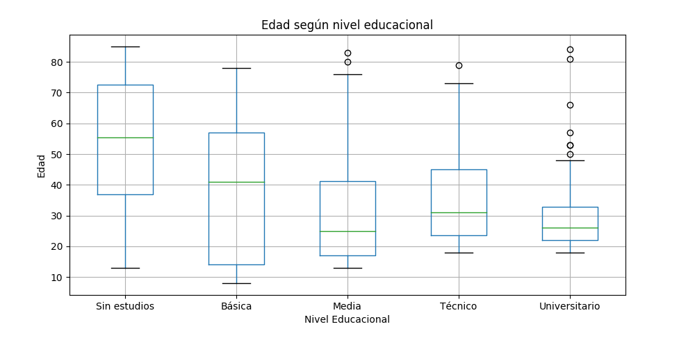

# Metodología
Estudio de corte tranversal. El universo fue toda la población del Servicio de Salud Viña del Mar Quillota (SSVQ). Se incluyeron todos los ciudadanos, se excluyen funcionarios de la salud. 
ixjhcjdshvhdcvho
# Resultados
Se realizaron 400 encuestas. En Viña del Mar, Quillota, Quintero y La Ligua se realizaron 100 encuestras en cada una, nadie rechazó participar.

## Carcterística de la muestra
Se encontraron 215 (53,7%) mujeres y 184 (46,0) hombres. La edad de los encuestados tuvo un promedio de 32,6 años con una edad mínima de 8 hasta una máxima de 85 años, el rango intercuartil fue de 18 a 45 años. Se muestra un histograma de edad de los encuestados. 

El nivel educacional de los encuestados fue sin estudios 6 (1,5%) personas, educación básica 57 (14%), educación media 208 (52,0%), educación técnica 59 (14,7%) y educación universitaria 70 (17,5%). La edad de los pacientes encuestados respecto a su nivel eduacional se puede encontrar en la figura X. El valor de p para la prueba de diferencias de medias de Kruskal Wallis fue menor a 0,01. 

## Conicimiento y pertinencia
La encuesta tenia dos grandes ítems: preguntas de conocimientos y pertinencia.
El ítem de conocimiento tenía tres preguntas, cada una de ella sumaba un punto. El mínimo 

# Conclusiones

La edad de la muestra difiere parcialmente a la nacional, atribuímos esto dado que la encuesta se realizó en la vía pública, lo que limita de manera importante a personas con movilidad reducida como los adultos mayores.

